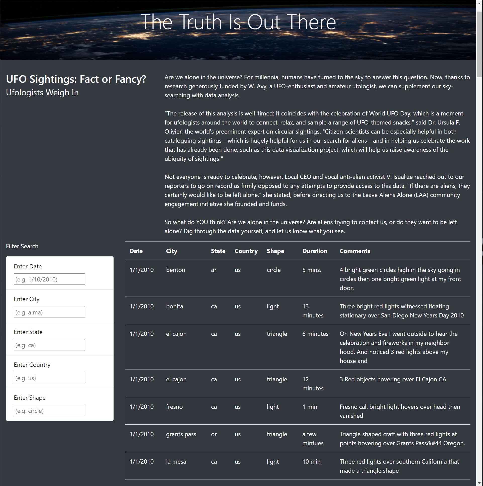
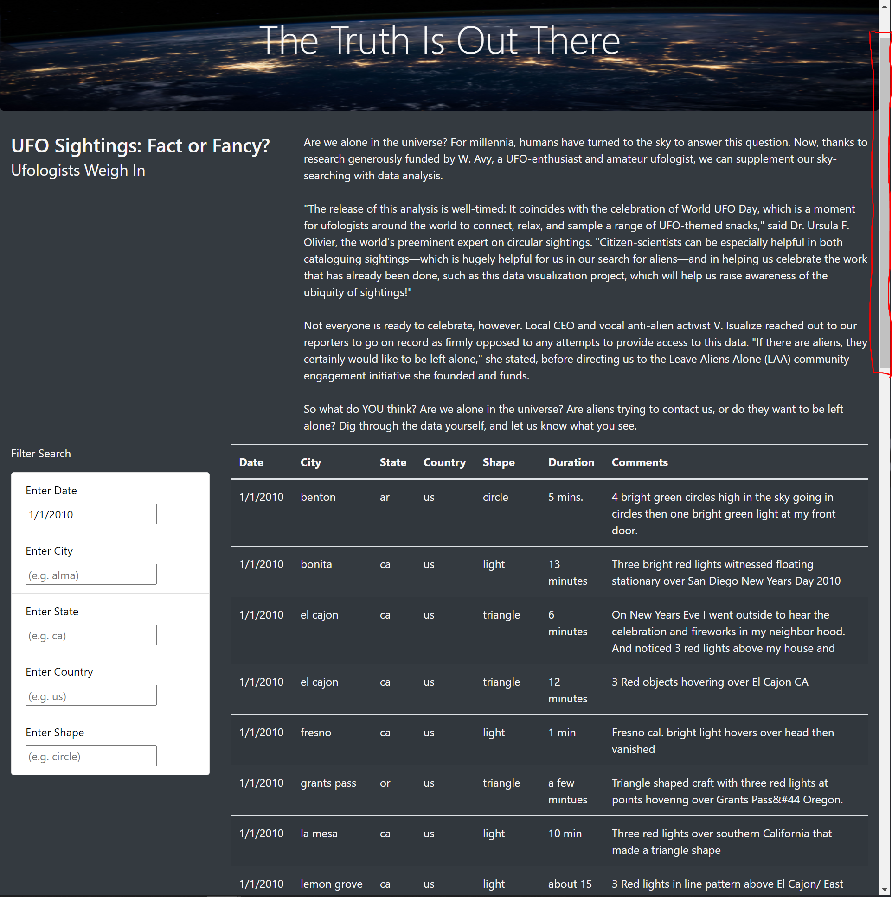
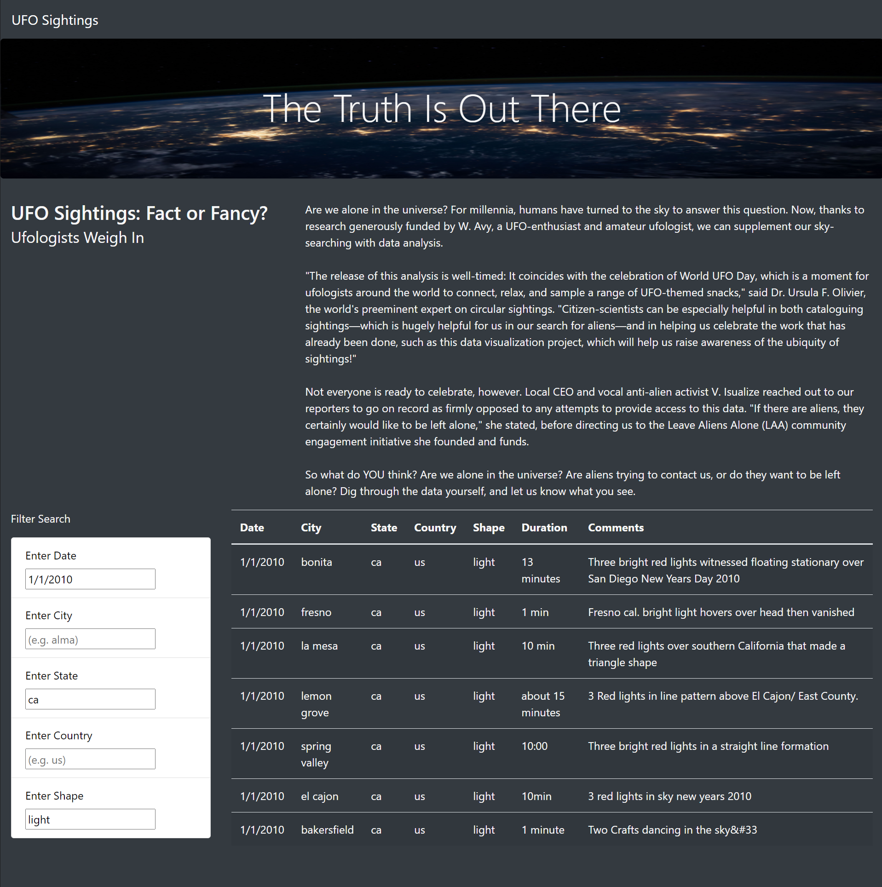

# UFOs
JavaScript, Bootstrap, HTML, CSS

# Overview
The project creates a webpage including a dynamic table with filter enabled allowing users to filter for multiple criteria at the same time. The filtering is controlled through JS and webpage is constructed using HTML and CSS formating. The main goal is to provide a more in-depth analysis to UFO's observations.  

# Results
Instructions:  
- When the webpage loaded (without any filtering conditions applied), the entire table including all the incident details is shown.  
  
- When an input is loaded in the "Filter Search" on the left, an update will be applied to the table based on the condition. Below is an example when the "Enter Date" filter is specified on "1/1/2010" (It can be observed from the sliding bar that data gets filtered).  
  
- When more inputs are loaded in the "Filter Search", the table will be updated based on the conditions. The example below shows four filtering conditions applied.  
  

# Summary
- Drawback: The web does not include a table export functionality. The user will have to manually copy and paste table contents for further data processing.  
- Improvement 1: If the input of filtering does not match the format provided in the input box, a warning should be given to the user.  
- Improvement 2: For aesthetics, when there are a lot of data, the table should collapse to only show 20 rows (for example). An internal sliding bar can be created to view the collapsed table.  
